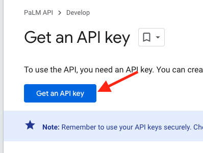
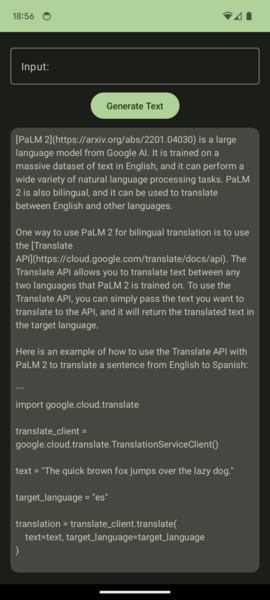

# PalmApiDemo

Ejemplo de cómo usar Palm API en Android con Kotlin


# Instrucciones

## 1. Llave PaLM API - GCP
Para poder usar el ejemplo primero crea tu llame de PalmApi en GCP, la cual la puedes obtener desde la misma consola haciendo click en [Get an API key](
https://developers.generativeai.google/tutorials/setup).




## 2. Guarda la llave en Properties
Dentro de tu proyecto Android, ubica tu archivo local.properties y escribe un nuevo valor llamado __palm_key__. El archivo debería quedarte similar de la siguiente forma:

``` groovy
sdk.dir=/Users/YOUR_NAME/Library/Android/sdk
palm_key="YOUR_PALM_API_KEY"
```

## 3. Compila y cruza dedos
Si todo lo anterior salió bien. Tu aplicación debe haber compilado correctamente y mostrar una pantalla similar a esta:



# Soporte
Si tienes dudas o quieres colaborar con este repo, no dudes en buscarme. [Te dejo mis redes](http://bio.link/tohure)